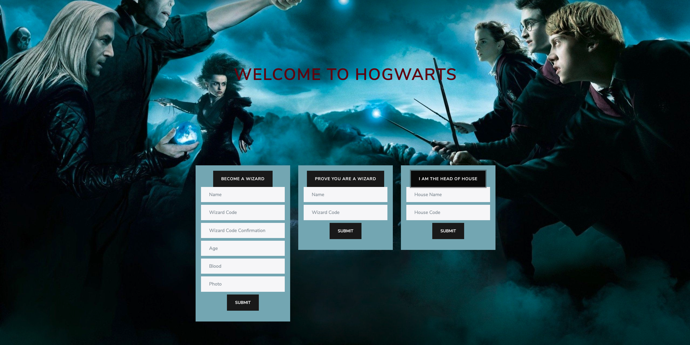

# Wizard world app (Javascript/ Rails API Application)

A wizard world application inspired by my favorite fiction book Harry Potter. It was made with Javascript, Ruby, Rails, SQLite, Bootstrap, API, HTML, and CSS

## TOOL

1. Javascript
2. Ruby
3. Rails API
4. Active Record
5. SQLite
6. Bcrypt
7. Bootstrap
8. HTML
9. CSS
  

## INTRUCTIONS

1. Clone this repository
2. Using the terminal navigate to the root directory
3. Run "Bundle Install"
4. Run "rails server" from backend directory
5. Open "index.html" file from frontend folder

## FEATURES

* If a user is the head of a house, they can enter the name of the house and house code to see all the wizards belong to their house.
* Users can register to become a wizard or enter the magical world if they have the right wizard code.(Check out Harry Potter using this information: {name: "Harry Potter", wizard code: "harry2021"}).
* When successfully enrolled at Hogward Magical School, wizards can see their information and can ask the Sorting hat to choose the right house for them.
* Wizards can leave a house and join other houses.
* Wizards can update their information.
* Wizards can shop at Diagon Alley, go to Ollivanders Wand Shop to buy a wand(a user should have only one wand). 
* Wizards can go to Flourish & Blotts to buy some books for their next semester.

## PREVIEW

